  

 

# ▸ ABOUT

    NAME        Raúl Martín Guerrero
    ROLE        IT Technician
    EXPERIENCE  16+ years
    LOCATION    Italy
    STATUS      ONLINE

I am an IT Technician focused on solving real-world technical problems.

I build reliable systems, automate repetitive tasks, document knowledge and create practical tools that make technology easier to understand and maintain.

My approach is simple:

> Technology should solve problems, not create them.

 

# ▸ FEATURED PROJECTS

## CV Para Todos

A free, privacy-focused CV generator based on open standards.

Create, manage and publish a professional CV without unnecessary complexity.

→ https://github.com/rmartinguerrero/CV-para-todos

---

## MrFix

A collection of technical utilities and troubleshooting tools for Windows.

→ https://github.com/rmartinguerrero/MrFix

---

## Content Creator

A modular content automation system focused on structured content generation, reusable workflows and AI-assisted automation.

🚧 Currently under active development.

 

# ▸ CURRENT MISSION

    [✓] Automation
    [✓] Documentation
    [✓] Open Source
    [✓] AI Tools
    [✓] Technical Solutions

Currently exploring better ways to combine automation, artificial intelligence and human-friendly technology.

 

# ▸ TOOLBOX

    SYSTEMS

    Linux
    Windows
    Docker
    GitHub

    AUTOMATION

    Bash
    Python
    Jenkins
    GitHub Actions

    TOOLS

    Astro
    WordPress
    Markdown

    MINDSET

    Architecture
    Documentation
    Problem Solving
    Open Source

 

# ▸ PHILOSOPHY

Technology is only valuable when it helps people.

I believe good systems should be:

- Reliable
- Simple
- Documented
- Easy to maintain

If a repetitive task can be automated, it probably should be.

 

# ▸ SYSTEM STATUS

    SYSTEM

    ONLINE

    CURRENT FOCUS

    Automation
    Documentation
    Open Source
    AI Tools

    BUILDING

    Practical Tools
    Technical Documentation
    AI Workflows

    MODE

    Continuous Improvement

 

# ▸ PROJECTS

## PUBLIC PROJECTS

Projects currently available to everyone.

| Project | Description |
|---------|-------------|
| ✅ **CV Para Todos** | Privacy-first CV generator based on the JSON Resume standard. |
| ✅ **MrFix** | Technical utilities and troubleshooting tools. |
| ✅ **MrFix-esp** | Spanish version of the MrFix toolkit. |
| ✅ **Supervivencia Laboral** | Resources and tools focused on today's working world. |
| ✅ **Giscus Integration** | Repository used for the comments system on my website. |
| ✅ **Personal Resume** | Static résumé published with GitHub Pages. |

 

## PRIVATE PROJECTS

Projects currently under active development.

| Project | Status | Open Source |
|---------|--------|-------------|
| ⚪ **raulmguerrero.com** | ✅ Completed | ❌ No |
| ⚪ **Content Creator** | 🚧 Work in Progress | ❓ Undecided |
| ⚪ **Nostaltum** | 🚧 Work in Progress | ❓ Undecided |

 

# ▸ CONTACT

**Website**

→ https://www.raulmguerrero.com

**Contact**

ES:
→ https://www.raulmguerrero.com/es/contacto

IT:
→ https://www.raulmguerrero.com/it/contatto

 

  
    RMG TECHNICAL WORKSTATION — SYSTEM ONLINE
  

